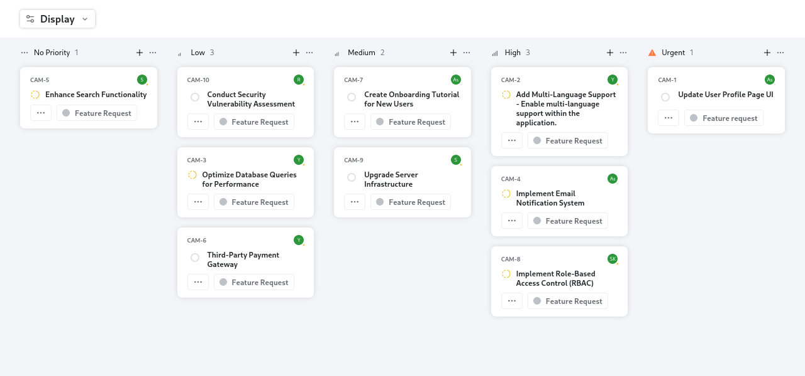

# QuickSell Kanban

A React-based web application built using Create React App. This project provides an intuitive and responsive user interface, showcasing modern web development practices.

[Live Demo](https://quicksell-liart.vercel.app/)

---

## Overview
QuickSell is a React application bootstrapped with Create React App. It features:
- Fast and efficient development environment.
- Responsive design suitable for both desktop and mobile platforms.
- A modular and scalable structure for modern web applications.

---

## Features
- **Development Mode:** Live reloading and linting.
- **Production Build:** Optimized for performance and size.
- **TypeScript Support:** Static typing for safer and more reliable code.
- **Interactive Components:** Built with React and React Icons.
- **Testing Capabilities:** Integrated with Jest and React Testing Library.

---

## Technologies Used

### Frontend
- **React:** JavaScript library for building user interfaces.
- **TypeScript:** Enhances development with static typing.
- **React Icons:** For scalable and customizable icons.
- **Tailwind CSS:** (if applicable, add specifics here if used in styling).

### Hosting
- Hosted on Vercel: [Live Demo](https://quicksell-liart.vercel.app/)

---

## Dependencies
```json
{
  "dependencies": {
    "@testing-library/jest-dom": "^5.14.1",
    "@testing-library/react": "^13.0.0",
    "@testing-library/user-event": "^13.2.1",
    "@types/jest": "^27.0.1",
    "@types/node": "^16.7.13",
    "@types/react": "^18.0.0",
    "@types/react-dom": "^18.0.0",
    "react": "^18.2.0",
    "react-dom": "^18.2.0",
    "react-icons": "^4.12.0",
    "react-scripts": "5.0.1",
    "typescript": "^4.4.2",
    "web-vitals": "^2.1.0"
  }
}
```

---

## Installation

### Prerequisites
- Node.js and npm installed.

### Steps
1. Clone the repository:
   ```bash
   git clone https://github.com/your-username/quicksell.git
   ```

2. Navigate to the project directory:
   ```bash
   cd quicksell
   ```

3. Install dependencies:
   ```bash
   npm install
   ```

4. Start the development server:
   ```bash
   npm start
   ```

5. Open your browser and navigate to:
   ```
   http://localhost:3000
   ```

---

## Preview




---

## Available Scripts

### `npm start`
Runs the app in development mode. Open [http://localhost:3000](http://localhost:3000) to view it in the browser.

### `npm test`
Launches the test runner in interactive watch mode.

### `npm run build`
Builds the app for production to the `build` folder. Optimizes the build for best performance.

### `npm run eject`
Ejects the configuration for full control. **Note:** This operation is irreversible.

---

## Learn More
To learn more about the tools used in this project:
- [Create React App documentation](https://facebook.github.io/create-react-app/docs/getting-started).
- [React documentation](https://reactjs.org/).
- [TypeScript documentation](https://www.typescriptlang.org/).

---

## Contribution
Contributions are welcome! Feel free to fork the repository and submit a pull request.

---

## Contact
For queries or feedback, please contact [Shubham](mailto:shubhamjaishu@gmail.com).
